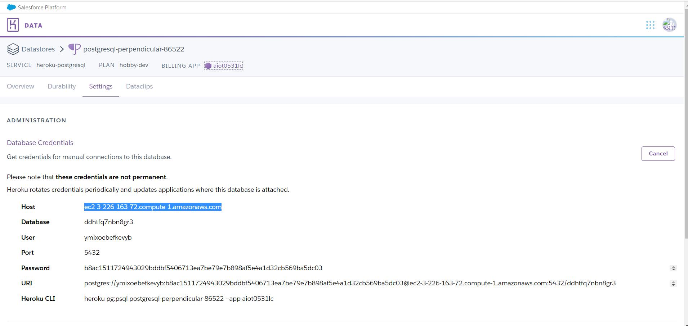
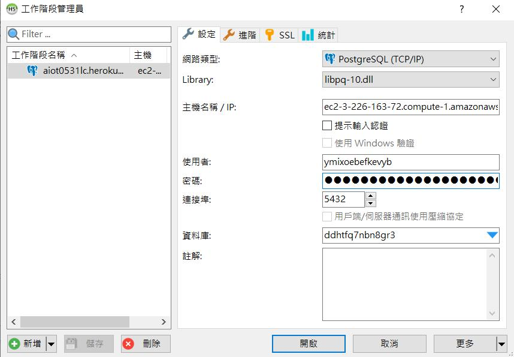
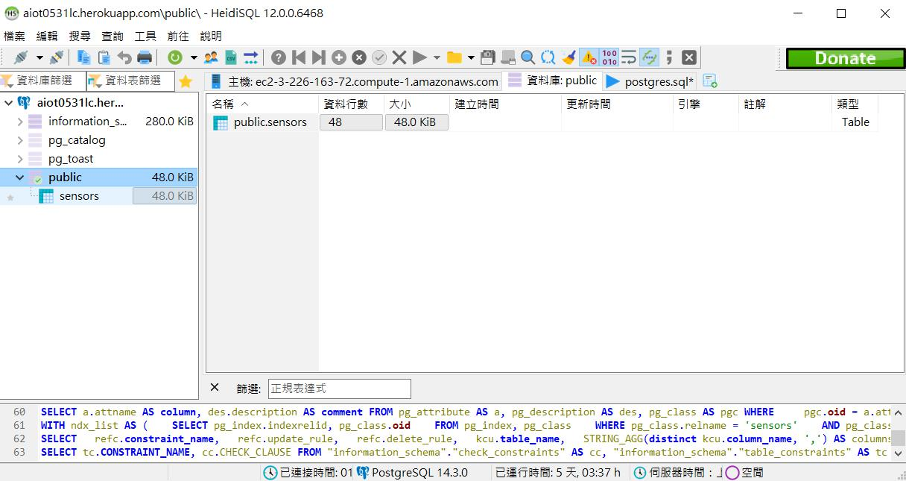
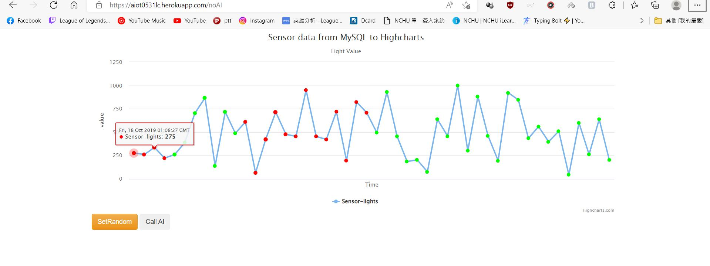

# AIoT Github

## Lecture 15: IoT Flask Web (deploy to heroku)
### 前置作業:註冊 Heroku, github 請下載 HeidiSQL, VS code 

### step 1 : Clone this github
 ctrl+shift+p 輸入 git:clone https://github.com/huanchen1107/aiot0530-start-no-token
 選擇自己要的folder存放
 原本是要把local folder裡的.git刪掉(以便產生自己的管理員)並建立自己的repository
 但我的電腦沒有.git 所以我自己新增了一個空資料夾再將必要資料放進去，這樣就可以建立自己的管理員了
### step 2 : install some package

* ctrl+` 開啟終端並輸入以下文字以安裝相關模組
```python
pip insall gunicorn   
Flask==2.0.1 
Jinja2==3.0.1 
psycopg2 
sklearn 
pandas  
numpy 
```

### step 3: add an heroku postgredb

* register heroku account
* go to dashboard
* new an app
* go to resource and add-on an Heroku postgredb

### step 4: login to heroku pstgredb using HeidiSQL
* 透過HeidiSQL登入STEP3建立的 heroku pstgredb 
下列為設定值(主機名稱 user 密碼 資料庫請依自己的postgredb填入)


### step 5: import postgredb (in db/postgre.db)
* ctrl+o並選擇db folder裡的postgre.db
* 執行

(出現照片裡的sensors 表示成功寫入資料庫)
### step 6: setting db in app.py
* app.py寫入db的資料如下述，改成自己的資料 透過app.py去跑db

```sql
myserver ="<fill-in-Heroku-Postgredb-DB-sever>"
myuser="<fill-in-Heroku-Postgredb-DB-user>"
mypassword="<fill-in-Heroku-Postgredb-DB-pwd>"
mydb="<fill-in-Heroku-Postgredb-DB-db>"

```
### step 7: testing locally by running python app.py
* 自己可以執行app.py並點擊產生連結試試看可不可以產生highchart
### step 8: deploy to github (new private github repositoy)
* 提交至github 


### step 9: Heroku deploy from github
*到heroku頁面連結自己github的repository
*deploy
### step 10: Complete
*deploy後會產生連結，即可以遠端執行程式並產生highchart
my link:
https://aiot0531lc.herokuapp.com/

* image
(call ai)

(no ai)


